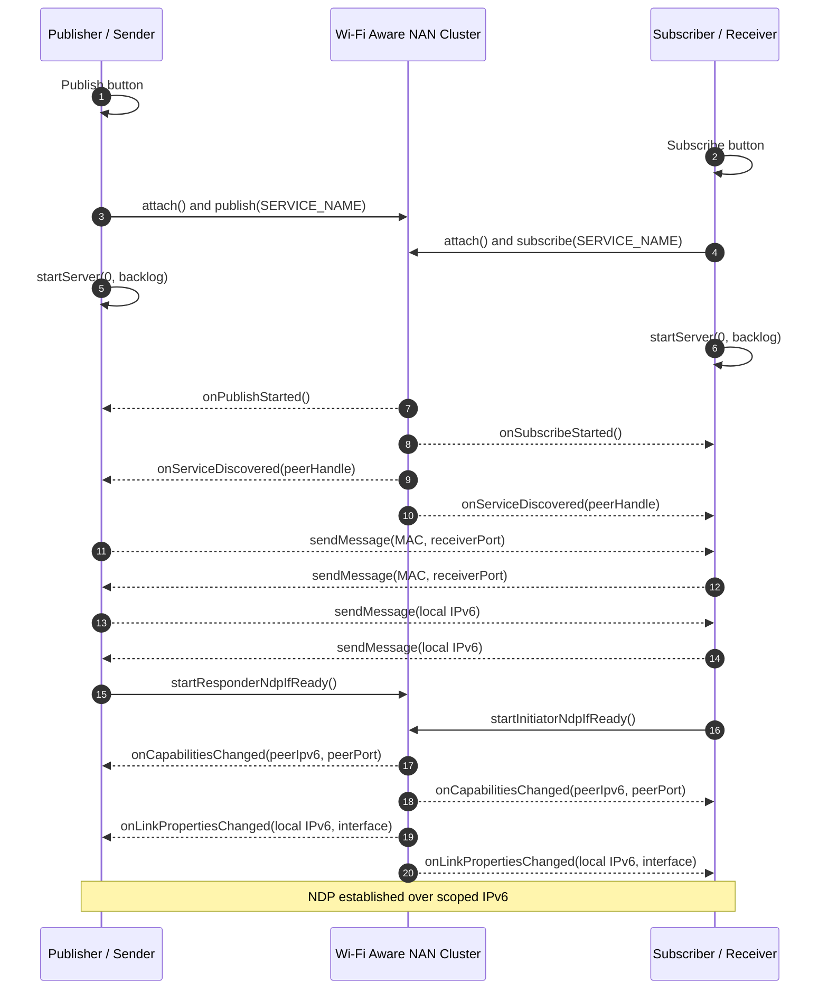

# NanR3 - Wi-Fi Aware File Transfer

A peer-to-peer file transfer application using Wi-Fi Aware (NAN - Neighbor Awareness Networking).

The `codex/transfer-engineering-optimization` branch includes optimized file transfer mechanisms, including improved reliability, retry handling, and transmission stability.

Please visit:
https://github.com/BojieLv/NanR3/tree/codex/transfer-engineering-optimization

## Features

- **Wi-Fi Aware Discovery**: Uses NAN to discover nearby devices without requiring a Wi-Fi network connection
- **NDP (Neighbor Data Path)**: Establishes direct IPv6 connection between devices
- **File Transfer**: Send files between devices over Wi-Fi Aware connection
- **Progress Tracking**: Shows transfer progress in real-time
- **Error Handling**: Graceful handling of connection issues and transfer failures

## Requirements

- Android 10 (API 29) or higher
- Device with Wi-Fi Aware support (NAN)
- Android Studio Hedgehog (2023.1.1) or later

### Wi-Fi Aware 3.0 Supported Devices

Wi-Fi Aware 3.0 (required for this application) is supported on the following flagship devices:

| Brand | Supported Models |
|-------|------------------|
| **Samsung** | Galaxy S22 and later flagship devices (S22, S22+, S22 Ultra, S23 series, S24 series, S25 series, S26 series) |
| **Xiaomi** | Xiaomi 14 and later flagship devices (Xiaomi 14, 14 Pro, 14 Ultra, 15 series, 17 series) |
| **Google** | Pixel 9 and later flagship devices (Pixel 9, 9 Pro, 9 Pro XL, 10 series) |

Note: Wi-Fi Aware availability varies by region and device model. Not all devices from these brands support Wi-Fi Aware 3.0.

## NDP and File Transfer Flow

### Phase 1: Wi-Fi Aware Discovery & NDP Establishment



```
┌─────────────────────────────────────────────────────────────────────────┐
│                    Publisher (Sender) Device                           │
├─────────────────────────────────────────────────────────────────────────┤
│                                                                        │
│  [Publish Button]                                                      │
│       │                                                                │
│       ▼                                                                │
│  [attach()] ──► [NAN Interface Up]                                     │
│       │                                                                │
│       ▼                                                                │
│  [onAttached()]                                                        │
│       │                                                                │
│       ▼                                                                │
│  [startServer()] ──► File Receiver Server Started                      │
│       │                                                                │
│       ▼                                                                │
│  [onServiceDiscovered(peerHandle)]                                     │
│       │                                                                │
│       ├───► sendMessage(MAC, port)                                     │
│       │                                                                │
│       ▼                                                                │
│  [onIdentityChanged()] ──► sendMessage(myIPv6)                         │
│       │                                                                │
│       ▼                                                                │
│  [startResponderNdpIfReady()]                                          │
│       │                                                                │
│       ├───► WifiAwareNetworkSpecifier                                 │
│       └───► requestNetwork()                                           │
│                │                                                       │
│                ▼                                                       │
│  [onCapabilitiesChanged()] ──► peerIpv6, peerPort                      │
│                │                                                       │
│                ▼                                                       │
│  [onLinkPropertiesChanged()] ──► local IPv6, interface                 │
│                                                                        │
└─────────────────────────────────────────────────────────────────────────┘
                                   │
                                   │  Wi-Fi Aware (NAN Cluster)
                                   ▼
┌─────────────────────────────────────────────────────────────────────────┐
│                   Subscriber (Receiver) Device                         │
├─────────────────────────────────────────────────────────────────────────┤
│                                                                        │
│  [Subscribe Button]                                                    │
│       │                                                                │
│       ▼                                                                │
│  [attach()] ──► [NAN Interface Up]                                     │
│       │                                                                │
│       ▼                                                                │
│  [onAttached()]                                                        │
│       │                                                                │
│       ▼                                                                │
│  [startServer()] ──► File Receiver Server Started                      │
│       │                                                                │
│       ▼                                                                │
│  [onServiceDiscovered(peerHandle)]                                     │
│       │                                                                │
│       ├───► sendMessage(MAC, port)                                     │
│       │                                                                │
│       ▼                                                                │
│  [onIdentityChanged()] ──► sendMessage(myIPv6)                         │
│       │                                                                │
│       ▼                                                                │
│  [startInitiatorNdpIfReady()]                                          │
│       │                                                                │
│       ├───► WifiAwareNetworkSpecifier                                 │
│       └───► requestNetwork()                                           │
│                │                                                       │
│                ▼                                                       │
│  [onCapabilitiesChanged()] ──► peerIpv6, peerPort                      │
│                │                                                       │
│                ▼                                                       │
│  [onLinkPropertiesChanged()] ──► local IPv6, interface                 │
│                                                                        │
└─────────────────────────────────────────────────────────────────────────┘
                                   │
                                   ▼
                         ┌─────────────────┐
                         │   NDP ESTABLISHED
                         │   IPv6 Connected
                         │   Ready to Transfer
                         └─────────────────┘
```

### Phase 2: File Transfer (Publisher → Subscriber)

```
┌─────────────────────────────────────────────────────────────────────────┐
│                         Sender Side                                    │
├─────────────────────────────────────────────────────────────────────────┤
│                                                                        │
│  [Send File Button]                                                    │
│       │                                                                │
│       ▼                                                                │
│  [ACTION_OPEN_DOCUMENT] ──► System File Picker                         │
│       │                                                                │
│       ▼                                                                │
│  [onActivityResult(fileUri)]                                           │
│       │                                                                │
│       ▼                                                                │
│  ┌───────────────────────────────────────┐                            │
│  │         clientSendFile() Thread       │                            │
│  │                                       │                            │
│  │  1. new Socket(peerIpv6, peerPort)   │                            │
│  │         │                            │                            │
│  │         ▼                            │                            │
│  │  2. writeUTF(fileName)               │                            │
│  │     writeLong(fileSize)              │                            │
│  │     writeUTF(mimeType)               │                            │
│  │         │                            │                            │
│  │         ▼                            │                            │
│  │  3. while(read = in.read(buffer))    │                            │
│  │        dos.write(buffer, 0, read)    │                            │
│  │                                       │                            │
│  └───────────────────────────────────────┘                            │
│                                                                        │
└─────────────────────────────────────────────────────────────────────────┘
                                   │
                                   │  TCP over Wi-Fi Aware NDP (IPv6)
                                   ▼
┌─────────────────────────────────────────────────────────────────────────┐
│                         Receiver Side                                  │
├─────────────────────────────────────────────────────────────────────────┤
│                                                                        │
│  ┌───────────────────────────────────────┐                            │
│  │         startServer() Thread          │                            │
│  │                                       │                            │
│  │  1. serverSocket.accept()             │                            │
│  │         │                            │                            │
│  │         ▼                            │                            │
│  │  2. readUTF() → fileName             │                            │
│  │     readLong() → fileSizeInBytes      │                            │
│  │     readUTF() → mimeType              │                            │
│  │         │                            │                            │
│  │         ▼                            │                            │
│  │  3. MediaStore.Downloads.insert()    │                            │
│  │         │                            │                            │
│  │         ▼                            │                            │
│  │  4. while(read = in.read(buffer))    │                            │
│  │        fos.write(buffer, 0, read)    │                            │
│  │                                       │                            │
│  └───────────────────────────────────────┘                            │
│       │                                                                │
│       ▼                                                                │
│  File Saved to: Downloads/NanR3/filename                               │
│                                                                        │
└─────────────────────────────────────────────────────────────────────────┘
```

### Message Protocol

| Message Length | Type       | Content                               |
|----------------|------------|---------------------------------------|
| 2 bytes        | Port       | File receiver server port (uint16)    |
| 6 bytes        | MAC        | Device MAC address                    |
| 16 bytes       | IPv6       | Wi-Fi Aware link-local IPv6 address   |
| > 16 bytes     | Message    | Application text message              |

### Key Implementation Details

- **Discovery**: Uses `onServiceDiscovered()` callback to get `PeerHandle`
- **Async NDP**: `startResponderNdpIfReady()` / `startInitiatorNdpIfReady()` are called at multiple points to handle async timing:
  - After `onPublishStarted()` / `onSubscribeStarted()`
  - After `onServiceDiscovered()`
  - After `onMessageReceived()`
  - After `onLinkPropertiesChanged()`
- **Duplicate Protection**: `initiatorNdpRequested` / `responderNdpRequested` flags prevent duplicate NDP requests
- **Permission Handling**: Uses `ACTION_OPEN_DOCUMENT` with `FLAG_GRANT_READ_URI_PERMISSION` - no storage permission required
- **File Storage**: Uses `MediaStore.Downloads` API (Android 10+) for saving received files

## Build

This project uses Gradle and the Android Gradle Plugin. On this machine, Java 17 from Android Studio's JBR is used:

```powershell
$env:JAVA_HOME='D:\ProgramData\Android-Studio\jbr'
$env:Path="$env:JAVA_HOME\bin;$env:Path"

# Build the project
.\gradlew assembleDebug

# Install on connected device
.\gradlew installDebug
```

## Controls

- `Publish`: Starts Wi-Fi Aware publish mode and automatically prepares NDP when a peer is found.
- `Subscribe`: Starts Wi-Fi Aware subscribe mode and automatically prepares NDP when a peer is found.
- `Capabilities`: Shows the current device's Wi-Fi Aware capability report.
- `Send File`: Opens the Android file picker and sends the selected file to the peer.
- Floating message button: Sends the text in the message field over the active discovery session.


## Usage

1. **On Sender Device**:
   - Tap "Publish" button to start advertising
   - Wait for peer discovery
   - Tap "Send File" button to select and send a file

2. **On Receiver Device**:
   - Tap "Subscribe" button to start scanning
   - Wait for peer discovery and NDP establishment
   - Received files are saved to Downloads/NanR3/ directory

## Permissions

The application requires the following permissions:

- `ACCESS_FINE_LOCATION`: Required for Wi-Fi Aware discovery
- `READ_EXTERNAL_STORAGE` (API <= 32): Legacy storage access (not required for modern devices)
- `WRITE_EXTERNAL_STORAGE` (API <= 28): Legacy storage access (not required for modern devices)

Note: File selection uses `ACTION_OPEN_DOCUMENT` which doesn't require storage permissions.


## Logcat Filters

Use Logcat filters:

```text
myNanR3.File|myNanR3.NAN
```

Important file-transfer logs include:

- File picker launch and selected URI.
- Peer IPv6 and file port readiness.
- Sender socket connection.
- Sender file header: name, size, MIME type.
- Receiver server bind port.
- Receiver socket accept.
- Receiver file header and save URI/path.
- Sender and receiver progress.
- Exception stack traces for send/receive failures.

## Limitations

- Requires Wi-Fi Aware hardware support (not available on all devices)
- Both devices must be on the same Wi-Fi channel for discovery
- Maximum file size is limited by available storage

## Troubleshooting

- Ensure Wi-Fi is enabled on both devices
- Ensure devices are within close proximity
- Check device specifications for Wi-Fi Aware support
- Review logcat for error messages:
  - Filter by tag "myNanR3" for application logs
  - Filter by "WifiAware" for system logs
  - Exception stack traces for send/receive failures.
